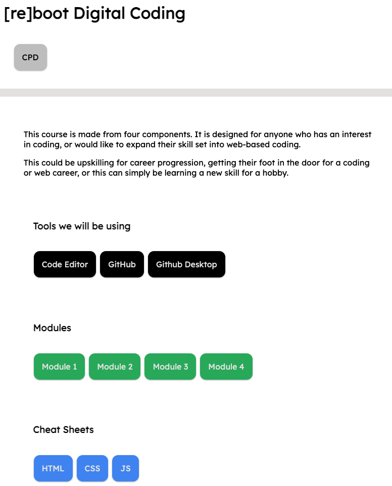

### [re]boot Digital Coding

This course is made from four components.

It is designed for anyone who has an interest in coding, or would like to expand their skill set into web-based coding. This could be upskilling for career progression, getting their foot in the door for a coding or web career, or this can simply be learning a new skill for a hobby.

#### Prerequisites

---

Before you continue, ensure you have met the following requirements:

- You have installed the latest version of Visual Studio Code.

- You have a live server extension installed and enabled in VS Code

#### How to use

---

1. `Fork` this project to your github account
2. `Clone` it from your account
3. Open up the main root `index.html `either in your browser manually or use the `VSCode` extension `live server`
4. Once the project is opened in your browser, you will be able to navigate the project at your own leisure or with the lecturer.

#### Screenshot

---

